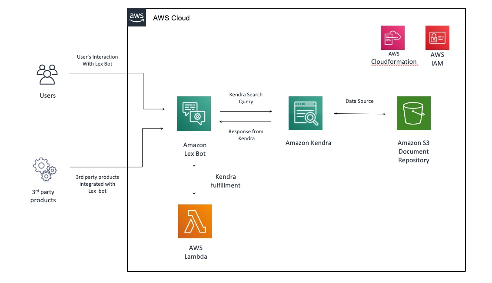

# quickstart-lex-kendra
## Amazon Lex Chatbot with Amazon Kendra on AWS

### Overview
This Quick Start reference deployment guide provides step-by-step instructions for deploying Amazon Lex chatbot with Kendra on the AWS Cloud.

This Quick Start sets up Amazon Kendra index, data source with Amazon S3 bucket as the document repository, and integrates it with Amazon Lex ChatBot. It can be used by organizations to enhance the search and fulfillment capabilities of their Lex chatbot by providing users with the ability to query the enterprise data repository using Kendra.

This Quick Start creates an Amazon Lex chatbot, along with a Kendra index. The Kendra index uses an S3 bucket as a data repository to create the Kendra data source linked to the index, along with an FAQ source. The Lex chatbot is connected to the Kendra index via the Kendra Search Intent.

This Quick Start is available in all the AWS regions where the following services are available:
- Amazon Lex
- Amazon Kendra
- Amazon S3
- AWS Lambda

### Architecture

Deploying this Quick Start with default parameters builds the following Amazon Lex chatbot with Kendra environment in the AWS Cloud. 

As shown in Figure 1, the Quick Start sets up the following:
- An Amazon Lex bot, with associated intents.
- An Amazon Kendra Index and data source.
- An AWS Lambda function,to enrich and compose responses to user from Lex chatbot.
- IAM roles for Lex bot, and Lambda function with necessary permissions to access AWS services and resources.

### Pre-requisites
Please make sure you have the following pre-requisites, before launching the CloudFormation templates to deploy the Quick Start.

1. An AWS Account.
2. An S3 bucket, which contains the sample documents that are used by Kendra to index and query. This S3 bucket is the document repository which will be used as a data source by Kendra, for sample Lex chatbot. You can bring your own documents or, use the sample documents in Quantiphi's S3 bucket s3://quickstart-quantiphi-lex-kendra/ .

### Deployment steps

1. Download [FAQ file](https://github.com/aws-quickstart/quickstart-quantiphi-lex-kendra-backend/blob/master/assets/FAQ-document/COVID_FAQ.csv) from the repository and upload it into the S3 bucket (mentioned in pre-requisites section above) which is used as document repository.
2. Click [Deploy](https://console.aws.amazon.com/cloudformation/home?region=us-east-1#/stacks/create/template?stackName=lex-kendra&templateURL=https://aws-quickstart.s3.amazonaws.com/quickstart-quantiphi-lex-kendra-backend/templates/lex_bot_kendra_master.template.yaml) to launch the CloudFormation template in your AWS Account. Click "Next".
3. Provide S3 bucket name (from the pre-requisite section above) for parameter 'S3 bucket with documents', and click Next.
4. On 'Configure stack options' screen, click Next.
5. Review the details, provide IAM_CAPABILITIES by clicking the check boxes under 'Capabilities' section, and click 'Create stack'. It will take approximately 25 minutes to create the stack.
5. Once the stack creation is complete, go to Amazon Lex console, find the bot named 'self_service_lex_bot' and click 'Test Chatbot' to start the conversation.
