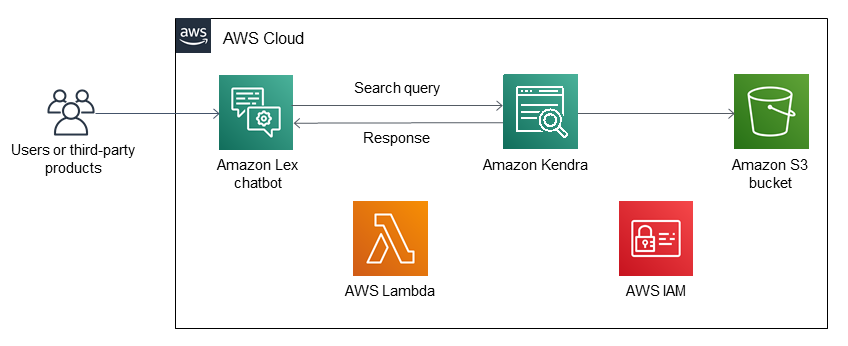

Deploying this Quick Start with default parameters builds the following {partner-product-name} environment in the AWS Cloud.

// Replace this example diagram with your own. Send us your source PowerPoint file. Be sure to follow our guidelines here : http://(we should include these points on our contributors giude)
[#architecture1]
.Quick Start architecture for {partner-product-name} on AWS
[link=images/quantiphi-architecture-diagram.png]

As shown in Figure 1, the Quick Start sets up the following:

* An Amazon Lex chatbot with associated intents for sending search queries to Amazon Kendra.
* An Amazon Kendra index for providing search results. 
* Amazon Simple Storage Service (Amazon S3) bucket used as the data source.
* An AWS Lambda function used to query the Amazon Kendra index and return the appropriate response.
* AWS Identity and Access Management (IAM) roles for the Amazon Lex chatbot, and a Lambda function with the necessary permissions to access AWS services and resources.

