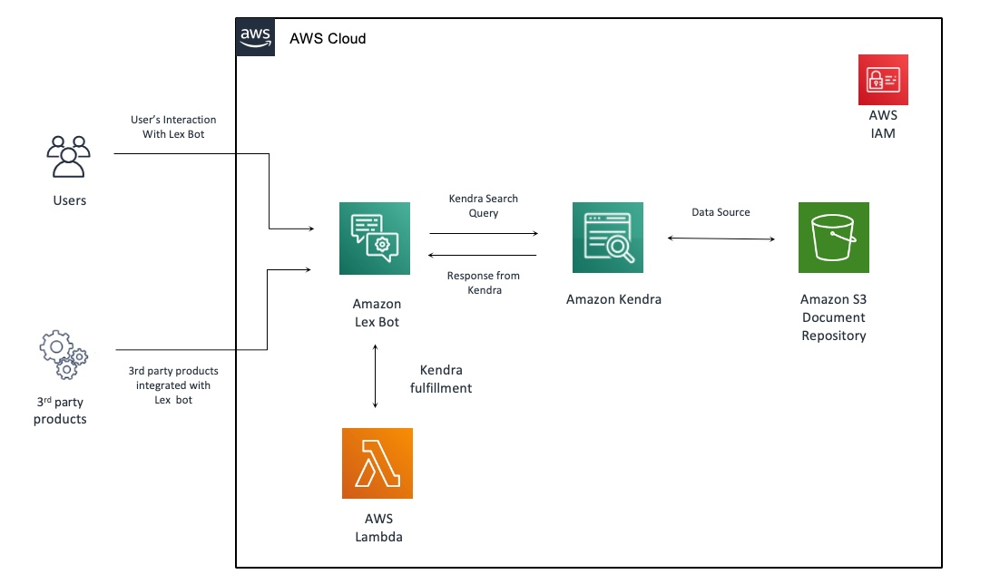

Deploying this Quick Start with *default parameters* builds the following _{partner-product-name}_ environment in the AWS Cloud.

// Replace this example diagram with your own. Send us your source PowerPoint file. Be sure to follow our guidelines here : http://(we should include these points on our contributors giude)
[#architecture1]
.Quick Start architecture for _{partner-product-name}_ on AWS
[link=images/architecture_diagram.jpg]

As shown in Figure 1, the Quick Start sets up the following:

* An Amazon Lex bot, with associated intents.
* An Amazon Kendra Index and data source.
* AWS Lambda function, used to query the Kendra index and return the appropriate response.
* IAM roles for Lex bot, and Lambda function with necessary permissions to access AWS services and resources.

